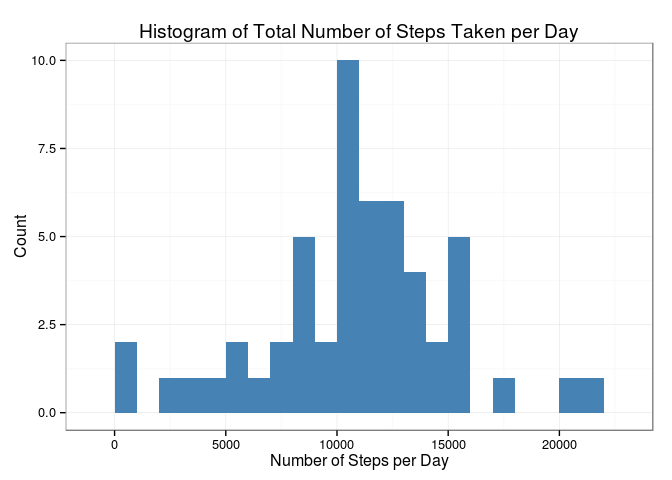
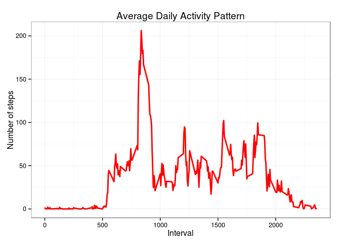
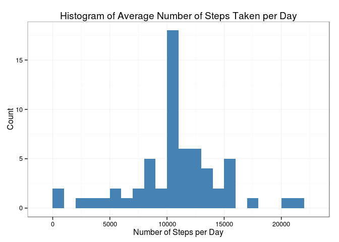
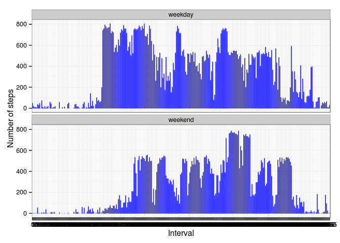

# Reproducible Research: Peer Assessment 1

```r
library(knitr)
opts_chunk$set(echo = TRUE, results = 'asis')
setwd("~/Learn R/ReproducibleResearch/RepData_PeerAssessment1")
```
## Loading and preprocessing the data
In this section I will read in the data from the csv file which has already been unzipped and saved in my working directoy.


```r
data <- read.csv('activity.csv', header = TRUE, sep = ",",
                  colClasses=c("numeric", "character", "numeric"))
data$date <- as.Date(data$date, format = "%Y-%m-%d")
data$interval <- as.factor(data$interval)
```
## What is mean total number of steps taken per day?


```r
#Histogram of the total number of steps taken each day
library(ggplot2)
steps_per_day <- aggregate(steps ~ date, data, sum)
colnames(steps_per_day) <- c("date","steps")
ggplot(steps_per_day, aes(x = steps)) + 
       geom_histogram(fill = "steelblue", binwidth = 1000) + 
        labs(title="Histogram of Total Number of Steps Taken per Day", 
             x = "Number of Steps per Day", y = "Count" )+ theme_bw() 
```

 

```r
### Mean and Median number of steps
steps_mean   <- mean(steps_per_day$steps, na.rm=TRUE)
steps_median <- median(steps_per_day$steps, na.rm=TRUE)
```
The mean number of steps taken per day is 10766.19 and the median number of steps taken per days is 10765.

## What is the average daily activity pattern?

First I will create a dataframe that aggregates the average number of steps for each interval across all the days.


```r
steps_per_interval <- aggregate(data$steps, 
                                by = list(interval = data$interval),
                                FUN=mean, na.rm=TRUE)
steps_per_interval$interval <- 
        as.integer(levels(steps_per_interval$interval)[steps_per_interval$interval])
colnames(steps_per_interval) <- c("interval", "steps")
## Time Series Plot of the Average Daily Activity Pattern
ggplot(steps_per_interval, aes(x=interval, y=steps)) +   
        geom_line(color = "red", size=1) +  
        labs(title="Average Daily Activity Pattern", x="Interval", y="Number of steps") +  
        theme_bw()
```

 

```r
## Interval that contains the maximum number of steps
max_interval <- steps_per_interval[which.max(  
        steps_per_interval$steps),]
```

The maximum number of steps is taken in the 835th interval.

## Imputing missing values
### Number of Missing Values

```r
missing_vals <- sum(is.na(data$steps))
```

There are 2304 missing values in the dataset.

### Strategy for filling missing values
To impute the missing values I will use the simple strategy of replacing it with the mean value for that interval across all days. First we find the index of all the steps where there are missing values and then replace it with the mean steps value computed in steps_per_interval dataframe. 


```r
na_index <- which(is.na(data$steps))
na_replace <- unlist(lapply(na_index, FUN=function(idx){
        interval = data[idx,]$interval
        steps_per_interval[steps_per_interval$interval == interval,]$steps
        }))
fill_steps <- data$steps
fill_steps[na_index] <- na_replace


data_fill <- data.frame(  
        steps = fill_steps,  
        date = data$date,  
        interval = data$interval)

# Check to make sure that there are no missing values.
sum(is.na(data_fill$steps))
```

[1] 0

There are no missing values now.

### Mean and Median Number of Steps Per Day


```r
fill_steps_per_day <- aggregate(steps ~ date, data_fill, sum)
colnames(fill_steps_per_day) <- c("date","steps")

##plotting the histogram
ggplot(fill_steps_per_day, aes(x = steps)) + 
       geom_histogram(fill = "steelblue", binwidth = 1000) + 
        labs(title="Histogram of Average Number of Steps Taken per Day", 
             x = "Number of Steps per Day", y = "Count") + theme_bw() 
```

 

```r
## Mean and Median Number of Steps taken each day
steps_mean_fill   <- mean(fill_steps_per_day$steps, na.rm=TRUE)
steps_median_fill <- median(fill_steps_per_day$steps, na.rm=TRUE)
```
 
The mean and median number of steps taken per day is 10766.19 after imputing the missing data.The mean remains unchanged compared to the dataset where missing values were removed, the median increases to 10766 from 10765.

## Are there differences in activity patterns between weekdays and weekends?
Create a new factor variable in the dataset with two levels – “weekday” and “weekend” indicating whether a given date is a weekday or weekend day.

```r
data_fill$day <- weekdays(data_fill$date)
data_fill$weekdays <- factor(data_fill$day)
levels(data_fill$weekdays)
```

[1] "Friday"    "Monday"    "Saturday"  "Sunday"    "Thursday"  "Tuesday"  
[7] "Wednesday"

```r
levels(data_fill$weekdays) <- list(weekday = c("Monday", "Tuesday",
                                             "Wednesday", 
                                             "Thursday", "Friday"),
                                 weekend = c("Saturday", "Sunday"))
```
Make a panel plot containing a time series plot (i.e. type = "l") of the 5-minute interval (x-axis) and the average number of steps taken, averaged across all weekday days or weekend days (y-axis). See the README file in the GitHub repository to see an example of what this plot should look like using simulated data.


```r
ggplot(data_fill, aes(x=interval, y=steps)) + 
        geom_line(color="blue") + 
        facet_wrap(~ weekdays, nrow=2, ncol=1) +
        labs(x="Interval", y="Number of steps") +
        theme_bw()
```

 

From the histogram the most notable difference in activity between weekdays and weekends is that the activity starts to peak at a later interval on weekends than on weekdays.
